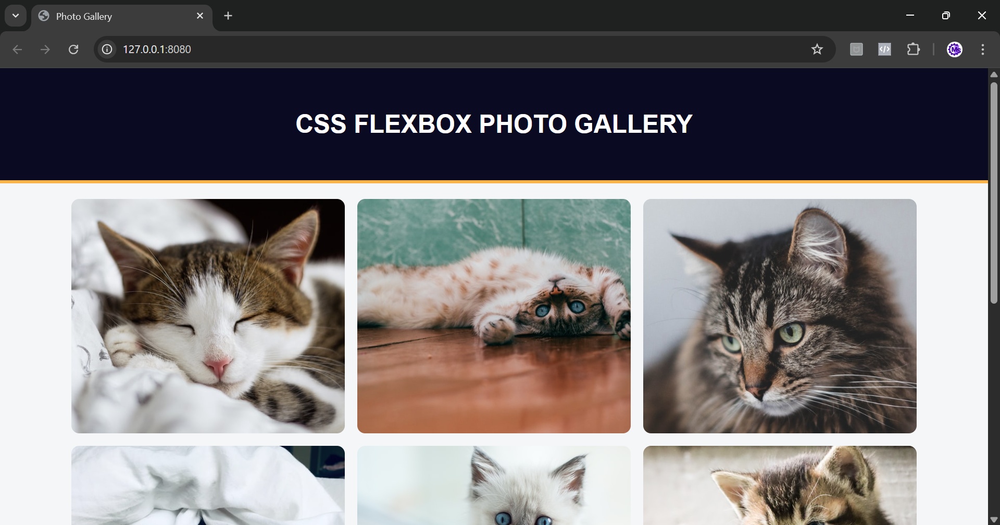

# css-flexbox-photo-gallery
This is a simple photo gallery web page built with HTML and styled using CSS Flexbox. It displays a collection of images in a responsive grid layout. The gallery uses external image links and references a stylesheet located at main.css.
(./images/web2.png)(./images/web3.png)
